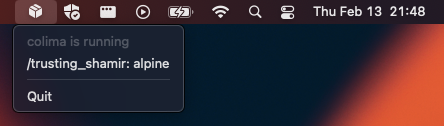

---

[](https://github.com/phkiener/homebrew-personal/blob/main/Casks/colima-status-bar.rb)
&nbsp;


---

# Colima StatusBar

A small menubar widget to show the status of [colima](https://github.com/abiosoft/colima).
Nothing too fancy, really.

## Installation

Either download the latest [GitHub Release](https://github.com/phkiener/ColimaStatusBar/releases/) and extract the `.app` bundle yourself
... or use homebrew!

```sh
brew install phkiener/personal/colima-status-bar
```

## Requirements

`colima` and `docker` are being invoked via your `$SHELL`, defaulting to `/bin/zsh`. Next to the command, the `--login` flag is passed as well to
make sure that e.g. your `homebrew`-path is available. If your shell doesn't support that... you're outta luck, sorry.
