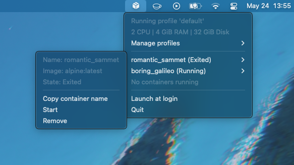

# Colima StatusBar

A small menubar widget to show the status of [colima](https://github.com/abiosoft/colima).
Nothing too fancy, really.

You can click on a container to copy its name!

## Configuration

By default, the status bar assumes you're running a standard colima configuration,
i.e. that the docker socket is available at `~/.colima/default/docker.sock`.
You can change the accessed socket by passing either `COLIMA_HOME` or `DOCKER_HOST`
to the application.

Configure them via`launchtl`, e.g. `launchctl setenv COLIMA_HOME /some/path`.
